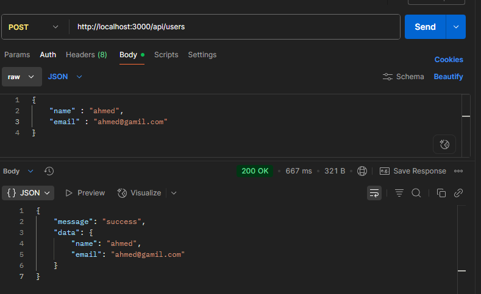
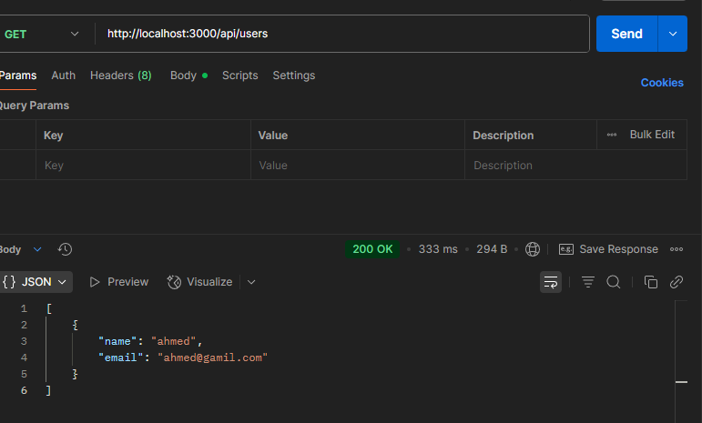
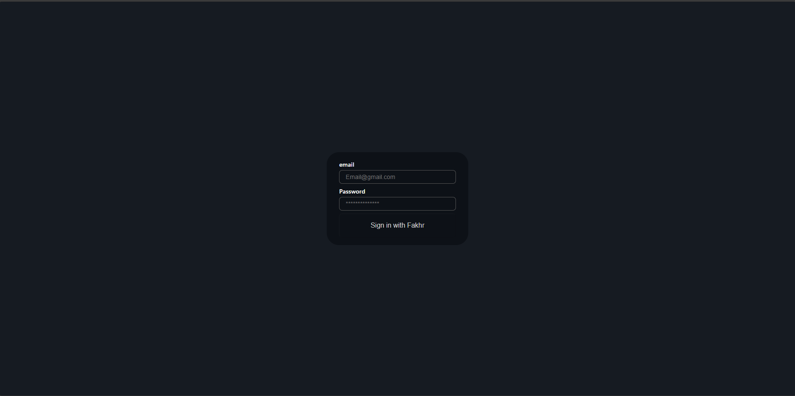

# next-auth

- Next Full-stack web application not only font

### create api using next

#### Let's Start

1. in app create folder names `api`
2. in `api` folder create another folder named `users`
3. in `users` cerate file named `route.ts` named route handler

- now api endpoint `http://localhost:3000/api/users`
- `localhost:3000` : base url

4. in `route.ts`

- create method `export async function GET(){}`

```ts
export async function GET() {
  return {
    name: 'ahmed',
    email: 'ahmed@gmail.com',
  };
}
```

- has error
- api return json data
- use `NextResponse.json()`

```ts
export async function GET() {
  return NextResponse.json({
    name: 'ahmed',
    email: 'ahmed@gmail.com',
  });
}
```

- now can create array to push users

```ts
interface IUser {
  name: string;
  email: string;
}
const User: IUser[] = [];
export async function GET() {
  return NextResponse.json(User);
}
```

- this method is get method
- now create post method
- in method `POST` send data in body take parm `req` type `request`

```ts
export async function POST(req: Request) {
  // req has method json type promise
  const body = await req.json();
  // body has something send in body
  User.push(body);
  return NextResponse.json({
    message: 'success',
    data: User,
  });
}
```



- now when you get



- `page.tsx`

```jsx
useEffect(() => {
  async function getUser() {
    const response = await fetch('http://localhost:3000/api/users').then(
      (res) => res.json()
    );
    console.log(response);
  }
  getUser();
}, []);
```

- but here don't have db to store data can use `prisma` google it

```ts
export async function POST(req: Request) {
  const body = await req.json();
  let isEmailExist: boolean = false;
  for (let i = 0; i < User.length; i++) {
    if (body.email == User[i].email) {
      isEmailExist = true;
    }
  }
  if (!isEmailExist) {
    User.push(body);
    return NextResponse.json(
      {
        message: 'success',
        data: User,
      },
      {
        status: 201,
      }
    );
  } else {
    return NextResponse.json(
      {
        message: 'Error Email already exist ',
      },
      {
        status: 400,
      }
    );
  }
}
```

---

### Credential

- make login email and pass

1. create this `/app/api/auth/[...nextauth]/route.ts`

- in `route.ts`

```ts
import NextAuth from 'next-auth';

const handler = NextAuth({
  providers: [],
});

export { handler as GET, handler as POST };
```

```tsx
import NextAuth from 'next-auth';
import CredentialsProvider from 'next-auth/providers/credentials';
const handler = NextAuth({
  providers: [
    CredentialsProvider({
      // The name to display on the sign in form (e.g. "Sign in with...")
      name: 'Credentials', // signin with ....
      // `credentials` is used to generate a form on the sign in page.
      // You can specify which fields should be submitted, by adding keys to the `credentials` object.
      // e.g. domain, username, password, 2FA token, etc.
      // You can pass any HTML attribute to the <input> tag through the object.
      credentials: {
        email: {
          label: 'email',
          type: 'email',
          placeholder: 'Email@gmail.com',
        },
        password: {
          label: 'Password',
          type: 'password',
          placeholder: '**************',
        },
      },
      // ---------------------------
      async authorize(credentials, req) {
        // Add logic here to look up the user from the credentials supplied
        const user = { id: '1', name: 'J Smith', email: 'jsmith@example.com' };

        if (user) {
          // Any object returned will be saved in `user` property of the JWT
          return user;
        } else {
          // If you return null then an error will be displayed advising the user to check their details.
          return null;

          // You can also Reject this callback with an Error thus the user will be sent to the error page with the error message as a query parameter
        }
      },
    }),
  ],
});

export { handler as GET, handler as POST };
// CredentialsProvider take two Credential and async function named authorize
```

- in url `http://localhost:3000/api/auth/signin`



- authorize

1. in `api.ts` create function login take email and password

```ts
async login(email: string, password: string) {
        return await fetch(this.#baseURL + "/api/v1/auth/signin", {
            body: JSON.stringify({
                email, password
            }),
            headers: this.#getHeader(),
            method: 'post'
        }).then(res => res.json())
    }
```

2. go to file in api

- get apiFunction

```tsx
const response = await apiServices.login(
  credentials?.email ?? '',
  credentials?.password ?? ''
);
```

- id must send

3. store data

```tsx
if (response.message == 'success') {
  const user = {
    id: response.user.email,
    name: response.user.name,
    email: response.user.email,
    role: response.user.role,
    token: response.token,
  };
  return user;
} else {
  return null;
}
```

- full code

```tsx
import { apiServices } from '@/services/api';
import NextAuth from 'next-auth';
import CredentialsProvider from 'next-auth/providers/credentials';
const handler = NextAuth({
  providers: [
    CredentialsProvider({
      // The name to display on the sign in form (e.g. "Sign in with...")
      name: 'Credentials', // signin with ....
      // `credentials` is used to generate a form on the sign in page.
      // You can specify which fields should be submitted, by adding keys to the `credentials` object.
      // e.g. domain, username, password, 2FA token, etc.
      // You can pass any HTML attribute to the <input> tag through the object.
      credentials: {
        email: {
          label: 'email',
          type: 'email',
          placeholder: 'Email@gmail.com',
        },
        password: {
          label: 'Password',
          type: 'password',
          placeholder: '**************',
        },
      },
      async authorize(credentials, req) {
        // Add logic here to look up the user from the credentials supplied

        const response = await apiServices.login(
          credentials?.email ?? '',
          credentials?.password ?? ''
        );
        // console.log(response);
        // id must send
        if (response.message == 'success') {
          const user = {
            id: response.user.email,
            name: response.user.name,
            email: response.user.email,
            role: response.user.role,
            token: response.token,
          };
          return user;
        } else {
          return null;
        }
      },
    }),
  ],
});

export { handler as GET, handler as POST };
// CredentialsProvider take two Credential and async function named authorize
```

### change design page

- in nextAuth take provider and take `pages`

```tsx
providers: [
        CredentialsProvider({
          ...
        })
    ],
    pages: {
        signIn: '/auth/login'
    }
```

- that mean when search in signin page not found search `/auth/login`
- now
- when search `http://localhost:3000/api/auth/signin` go to `/auth/login`
- and in pages create folder `auth` contain folder `login` and in login create file `page.tsx` and insert your design
- i will write full code and insert it

```tsx
const form = useForm();
const router = useRouter();
async function onSubmit(values: any) {
  // now i need use credential
  // next auth has signIn from next-auth/react
  // signIn('credentials' , 'google' , etc.... ,{
  //   option what you need to send to backend
  // })
  // now i need to signIN with credentials
  try {
    const response = await signIn('credentials', {
      // what send to backend
      email: values.email,
      password: values.password,
      redirect: false,
    });
    if (response?.ok) {
      router.push('/products');
    }
  } catch (error) {
    alert(JSON.stringify(error));
  }
  // this function return promise

  // console.log(values);
}
```

### CallBacks

##### isLoggedIn or No

- in containerProvider add sessionProvider

```tsx
  return (
    <SessionProvider>
      <Provider store={store}>
        {' '}
        <CartContextProvider>{children}</CartContextProvider>{' '}
      </Provider>
    </SessionProvider>
  );
}

```

- `useSession` function
- now when go to `navbar` and create function async await session

```tsx
const session = useSession();
console.log(session);
```

- in `cl` return obj contain this data

```bash
expires:"2025-10-14T10:49:28.419Z"
user:
  email:"ahmedmutt@gmail.com"
  name:"Ahmed Abd Al-Muti"
```

- now i need to store more data same `token` ...
- in `route.ts` take provider and pages and `callbacks`

```tsx
,
    callbacks: {
        async session({session , token}){
            session.user.role = token.role

            return session
        }
    }
```

- now has error because user not contain a role in ts
- go to website nextAuth and get this code
- in type create this folder and file `types/next-auth.d.ts`

```ts
import NextAuth, { DefaultSession } from 'next-auth';

declare module 'next-auth' {
  /**
   * Returned by `useSession`, `getSession` and received as a prop on the `SessionProvider` React Context
   */
  interface Session {
    user: {
      /** The user's postal address. */
      address: string;
    } & DefaultSession['user'];
  }
}
```

- and update your code

```ts
import NextAuth, { DefaultSession } from 'next-auth';

declare module 'next-auth' {
  /**
   * Returned by `useSession`, `getSession` and received as a prop on the `SessionProvider` React Context
   */
  interface Session {
    user: {
      role: string;
      /** The user's postal address. */
      address: string;
    } & DefaultSession['user'];
  }
}
```

- now when add

```ts
import NextAuth, { DefaultSession } from 'next-auth';

declare module 'next-auth' {
  /**
   * Returned by `useSession`, `getSession` and received as a prop on the `SessionProvider` React Context
   */
  interface Session {
    token: string;
    user: {
      role: string;
      /** The user's postal address. */
    } & DefaultSession['user'];
  }
  interface User {
    token: string;
    role: string;
  }
}
```

- in route.ts

```ts
pages: {
        signIn: '/auth/login'
    },
    callbacks: {
        async session({ session, token }) {
            session.user.role = token.role as string
            session.token = token.token as string
            return session
        },
        async jwt({ token, user }) {
            if (user) {
                token.token = user.token
                token.role = user.role
            }
            return token
        }
    },
    secret: process.env.AUTH_SECRET,
    session: {
        strategy: 'jwt'
    }
```

```tsx
const session = useSession();
console.log(session);
```

- now in cl you have data and status

```bash
{data: {…}, status: 'authenticated', update: ƒ}
```

- now go to navbar and destruct this form useSession()

- and use it

```tsx
{
  /* User Account */
}
{
  status == 'loading' ? (
    'Loading..'
  ) : status == 'authenticated' ? (
    <>
      <Button variant="ghost" size="icon">
        <User className="h-5 w-5" />
        <span className="sr-only">Account</span>
      </Button>

      {/* Shopping Cart */}
      <Link href={'/cart'}>
        <Button variant="ghost" size="icon" className="relative">
          <ShoppingCart className="h-5 w-5" />
          <span className="absolute -top-1 -right-1 h-4 w-4 rounded-full bg-primary text-xs text-primary-foreground flex items-center justify-center">
            {cartLoading ? <Loader2 className="animate-spin" /> : cartCount}
          </span>
          <span className="sr-only">Shopping cart</span>
        </Button>
      </Link>
      <p>{data.user.name}</p>
      <Button
        onClick={() => {
          signOut();
        }}
        variant="ghost"
        size="icon"
      >
        <LogOut className="h-5 w-5" />
        <span className="sr-only">Logout</span>
      </Button>
    </>
  ) : (
    <Link href={'/auth/login'}>Login</Link>
  );
}
```

### middleWare

- now same i need to go cart but i don't have account go it i need if i have account and token go to cart else no
- in nextjs search file middleware
- in `src` create file named `middleware.ts` and get code from next

```ts
import { NextResponse, NextRequest } from 'next/server';

// This function can be marked `async` if using `await` inside
export function middleware(request: NextRequest) {
  return NextResponse.redirect(new URL('/home', request.url));
}

export const config = {
  matcher: '/about/:path*',
};
```

- and update it

```ts
import { getToken } from 'next-auth/jwt';
import { NextResponse, NextRequest } from 'next/server';

// This function can be marked `async` if using `await` inside
export async function middleware(request: NextRequest) {
  // now has a function name getToken return token is obj take req : request

  const token = await getToken({ req: request });

  if (token?.token) {
    NextResponse.next(); // if has a token next
  } else {
    return NextResponse.redirect(new URL('/auth/login', request.url));
  }
}
export const config = {
  //  I don’t want users without a token to be able to access it.
  matcher: '/cart',
};
```

- now i need when search `/cart` and i don't login when login go to cart not products

- in middleware
- useSearchParams to get callback url

```ts
const token = await getToken({ req: request });

if (token?.token) {
  NextResponse.next(); // if has a token next
} else {
  const loginUrl = new URL('/auth/login', request.url);
  loginUrl.searchParams.set(
    'callbackUrl',
    request.nextUrl.pathname + request.nextUrl.search
  );
  return NextResponse.redirect(loginUrl);
}
```

- and in login

```tsx
const searchParams = useSearchParams();
  const callbackUrl = searchParams.get('callbackUrl') || '/products';
  async function onSubmit(values: any) {
    try {
      const response = await signIn('credentials', {
        email: values.email,
        password: values.password,
        redirect: false,
      });
      if (response?.ok) {
        router.push(callbackUrl);
      }
    } catch (error) {
      alert(JSON.stringify(error));
    }
```

/\/\/\/\/\/\\/\/\/\/\/\//\\\/\'\/\/\/\/\//\///\/\//\/\/\/\/\/\\/\/\/\/\/\//\\\/\'\/\/\/\/\//\///\/\//\/\/\/\/\/\\/\/\/\/\/\//\\\/\'\/\/\/\/\//\///\/\
/\/\/\/\/\/\\/\/\/\/\/\//\\\/\'\/\/\/\/\//\///\/\//\/\/\/\/\/\\/\/\/\/\/\//\\\/\'\/\/\/\/\//\///\/\//\/\/\/\/\/\\/\/\/\/\/\//\\\/\'\/\/\/\/\//\///\/\
/\/\/\/\/\/\\/\/\/\/\/\//\\\/\'\/\/\/\/\//\///\/\/ Feneto Fakhr Basha /\/\/\/\/\/\\/\/\/\/\/\//\\\/\'\/\/\/\/\//\///\/\//\//\\\/\'\/\//\/\/\/\/\/\/\/
/\/\/\/\/\/\\/\/\/\/\/\//\\\/\'\/\/\/\/\//\///\/\//\/\/\/\/\/\\/\/\/\/\/\//\\\/\'\/\/\/\/\//\///\/\//\/\/\/\/\/\\/\/\/\/\/\//\\\/\'\/\/\/\/\//\///\/\
/\/\/\/\/\/\\/\/\/\/\/\//\\\/\'\/\/\/\/\//\///\/\//\/\/\/\/\/\\/\/\/\/\/\//\\\/\'\/\/\/\/\//\///\/\//\/\/\/\/\/\\/\/\/\/\/\//\\\/\'\/\/\/\/\//\///\/\
